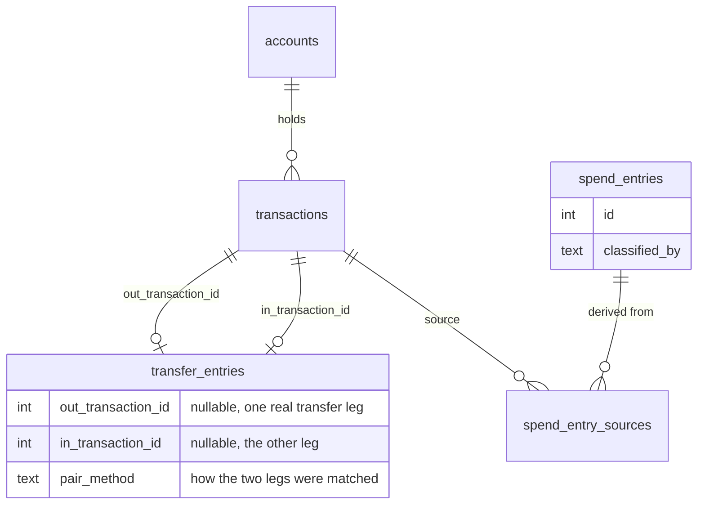

# Transfer ledger — design

Current-state reference for the persisted transfer ledger
(`transfer_entries`). For how this got here — the original per-leg design,
the real bugs found while building it, and the user decisions along the
way (including the correction from "one row per leg" to "one row per
transfer") — see [transfer-ledger-history.md](transfer-ledger-history.md).
Companion ADR:
[0009 — Persisted ledgers, built at import, queried never re-derived](../adr/0009-persisted-ledgers-built-at-import.md).
Grounding detail: [Transfer Detection — Technical Notes](../developer-docs/transfer-detection.md).
Known design gap (credit card payments still using the legacy
`transaction_links` mechanism instead of `transfer_entries`, and whether
`transaction_links` can be retired once fixed): [Transfer Ledger /
`transaction_links` — Critique](transfer-ledger-critique.md).

## Summary

- `transfer_entries` is the **transfer ledger**: one **transfer entry**
  per real-world transfer, written once during `ledgr import`'s
  derivation pass — mirroring `spend_entries`' provenance conventions. A
  **transaction** is the raw imported record; a **transfer entry** is
  `ledgr`'s derived judgement that two transactions (or one transaction
  and a household counterpart that will never itself be imported) are the
  two legs of the same transfer. This is the same distinction the spend
  ledger already draws between a transaction and a **spend entry** — the
  transfer ledger just links *two* transactions per entry, not one.
- Each transfer entry directly names both legs: the side money left
  (`out_*` columns) and the side it arrived (`in_*` columns). Either side
  is `NULL` until that leg's real transaction is known — `classify()`
  only ever resolves one raw transaction at a time, so a transfer entry
  is always created one-sided and then completed once the other leg is
  found, which may be immediately, much later (cross-file import timing),
  or never (a Reference Household Account has no `transactions.id` to
  ever point at).
- Pairing (finding the second leg) uses a **three-tier algorithm**,
  cheaper/higher-confidence tiers first: description cross-reference,
  mutual classification match, self-reference match (see "Pairing
  algorithm" below).
- Pairing can complete **retroactively**, and — unlike a straightforward
  "new leg completes an old one" — can also merge **two already-persisted
  one-sided entries** into one, which is what actually happens when
  neither leg was fresh in the run that finally pairs them (e.g. a
  pairing tier added after both legs already existed, unpaired).
- `transaction_links` (see `src/db/schema.sql` for the exact DDL) is a
  separate, older, generic edge table linking two transactions for
  several unrelated reasons (`relation` — `transfer`/`refund`/
  `duplicate_of`/`related`). It is **not** part of the transfer ledger —
  the only reason it comes up here at all is a known, unresolved gap: a
  **credit card payment** (see that term in `ubiquitous-language.md`) is,
  by definition, a kind of internal transfer, but its matching code
  (`Classification::CardPayment`) still writes to `transaction_links`
  (`relation='transfer'`, `confidence=0.85`) instead of to
  `transfer_entries` like every other internal transfer does. So a
  household's credit card repayments currently do **not** appear in the
  transfer ledger or the Monthly Transfers screen. Flagged as a follow-up
  (not yet actioned), not a design feature of this table — full analysis,
  including why `transaction_links` can't simply be deleted once this is
  fixed (refund linking is a second, independent live writer), in
  [transfer-ledger-critique.md](transfer-ledger-critique.md).

## Schema at a glance

`transaction_links` is deliberately left off this diagram — it's not
part of the transfer ledger's design, only tangled up with it via the
credit-card-payment gap noted above. See `src/db/schema.sql` for the
full DDL of every table, including `transfer_entries`.

A fully paired transfer is **one** row, both `out_*` and `in_*` filled. A
transfer to/from a Reference Household Account, or to/from an
unregistered named individual, is also **one** row, permanently missing
one side (there is no second transaction to ever record) — not a
"pairing failed" state to keep retrying, but a stable, expected one.

### Why not extend `transaction_links` instead of a new table

- `transaction_links` has no row at all for an unpaired-but-classified
  leg — exactly the "stay visible" case this table needs to represent.
- It carries no classification provenance (`classified_by`/`confidence`/
  `rule_name`) — conflating "this is a transfer" with "these two rows are
  paired" into one edge made the automated-transfer gap that motivated
  this delta read like a correctness bug rather than what it actually
  was (correct classification, incomplete pairing).
- `spend_entries` already established the convention of a derived ledger
  row per classified item, with its own provenance shape, separate from
  the generic `transaction_links` edge table (which remains in use for
  the genuinely edge-like `refund`/`duplicate_of`/`related` relations, and,
  for now, **credit card payment** matching — see the gap noted above).

## Pairing algorithm

Runs as part of `run_derivation` (`src/derive.rs`), in two stages. There
is no separate `derive_transfer_entries` function: `run_derivation` makes
one `classify()` call per transaction, and the result — spend entry,
transfer leg, credit card payment, or out-of-scope — is a single decision, not
independent passes over the same data, so transfer pairing is a branch
inside this one function rather than a second derivation pass.

**Stage 1 — inline, while classifying each transaction.** For every
transaction `classify()` resolves to `Classification::InternalTransfer`,
determine its role (`Out` if `amount_minor < 0`, `In` otherwise) and try,
in order:

1. **`description_match`** (`pair_confidence = 0.9`) — search the
   decoded counterpart account's own transactions for an
   equal-and-opposite amount within a ±3 day window, whose `description`
   cross-references *this* leg's account (`description LIKE (own_prefix
   || '%')`). Works for manual transfers, where both sides' `NAME`
   fields cross-reference each other's account number. Searches raw
   `transactions`, not `transfer_entries`, so it works regardless of
   whether the counterpart has itself been classified yet. If the found
   counterpart transaction already has a `transfer_entries` row (an open
   one, from earlier), that row is completed; otherwise a brand-new
   fully-paired row is created directly (`Db::create_paired_transfer`).
2. **`amount_date_match`** (`pair_confidence = 0.75`) — search
   currently-open `transfer_entries` rows for one missing this leg's
   role, whose known side's account matches this leg's own decoded
   counterpart, with equal-and-opposite amount and a ±3 day window. If
   found, and that row's own prediction for the missing side correctly
   names *this* leg's account (mutual agreement — both sides decode each
   other correctly), the row is completed at this tier.
3. **`self_reference_match`** (`pair_confidence = 0.6`) — same search as
   tier 2, but fires when the found row's own prediction points at
   *itself* instead of this leg (the signature of a `NAME` field that
   names its own account rather than the sender's — e.g. the real SHARED
   BILLS ACCO standing order). No mutual cross-check at all; the only
   signal is "this leg's own decode correctly reaches the open row" plus
   amount/date.
4. **No match** — the leg is recorded as its own new one-sided row
   (`Db::insert_transfer_leg`), predicted counterpart account/digits
   filled in from this leg's own decode, transaction/account/description
   left `NULL` on the missing side.

**Stage 2 — a re-pairing sweep, after every transaction this run has been
classified.** Re-attempts pairing across every currently open
(one-sided) `transfer_entries` row, independent of whether a new
transaction arrived this run — necessary because a row can become
pairable purely because *another already-open* row's own decode names
it, with no new transaction ever needing to arrive to trigger that (the
concrete case: two legs persisted, unpaired, by an earlier run, before a
pairing tier that could match them existed at all — this is exactly what
happened when tier 3 was added, see the history doc). For each open row,
the same tier 2/3 logic runs using its own known side to search for a
completing counterpart among the *other* open rows; on a match, the two
rows are merged into one (the redundant row is deleted) and the surviving
row is completed exactly as in stage 1.

### Why tier 3 doesn't relax to a bare amount+date match

A bare amount+date match with no other signal risks pairing two
*unrelated* equal-amount transfers on the same day. Tier 3 avoids this
without a mutual cross-check by keying specifically on the self-reference
signature (the candidate's own decode points at *itself*) — a property
that essentially never holds by coincidence, since it requires the
candidate's own `NAME` field to happen to encode its own exact sort code
and account number, not just plausibly.

## Integration into `run_derivation`

- `pending_derivation_transactions` (`src/db/spend.rs`) excludes any
  transaction that already appears as either side of a `transfer_entries`
  row (as well as its existing `spend_entry_sources` exclusion), so an
  already-recorded leg is not needlessly reprocessed on future `ledgr
  import` runs.
- `DerivationSummary` tracks `transfers_detected` (transactions
  classified `InternalTransfer` this run — counted even for a transaction
  that turns out to already have a row this run, e.g. as another leg's
  tier-1 counterpart), `transfers_paired` (pairings completed this run,
  by either stage), and `transfers_backfilled` (a pairing where the
  *other* side predates this exact operation — always true for stage 2's
  sweep, since both sides are by definition already-persisted rows; true
  in stage 1 whenever the matched counterpart wasn't itself classified
  earlier in this same run).

## Serving the UI

1. **Monthly aggregates** (`Db::monthly_transfer_totals`) — a single
   `GROUP BY substr(occurred_on, 1, 7)` query over `transfer_entries`,
   summing `amount_minor` across rows whose `out_transaction_id`/
   `in_transaction_id` is known respectively (independent of each other —
   a one-sided row still represents real money having moved on its known
   side) — negated for "out" to match the existing signed display
   convention, kept separate from "in" rather than netted.
2. **Per-month drill-down** (`Db::transfer_entries_for_month`) — one row
   per `transfer_entries` row, which is already one row **per real-world
   transfer** — the schema itself guarantees this, no display-layer
   deduplication needed. "From"/"To" resolve directly: a known side's
   `*_account_id` names a tracked account; an unresolved side's
   `*_sort_code`/`*_account_number` fall back to a Reference Household
   Account label (from config) or the raw digits (`App::resolve_transfer_leg_name`,
   `src/app.rs`).
3. **"Show both legs" popup** (`App::show_transfer_detail`) — both legs
   already live directly on the selected row; no query needed beyond
   `Db::get_transaction` to fetch the full transaction record for
   whichever side(s) are known. The outgoing side is shown as "own"
   (matching the drill-down's canonical row), falling back to the
   incoming side for the rare row missing an outgoing transaction.

`src/ui.rs` needed only column-source changes (reading `out_*`/`in_*`
instead of a single `counterpart_*` pair) — layout, popup rendering, and
clipboard copy (`y`) are otherwise unaffected.

## Real worked examples (`~/.local/share/ledgr/ledgr.db`, as migrated)

The SHARED BILLS ACCO ↔ Bills Account pair that motivated this entire
delta — a real recurring £3,415/month standing order between "Barclays
Current Account (...1892)" (id 1, "Jims Premier Account" in the TUI) and
"Barclays Current Account (...5086)" (id 3, "Bills Account") — is **one**
row:

| Column | Value |
|---|---|
| `id` | 147 |
| `occurred_on` | 2026-06-01 |
| `amount_minor` | 341500 |
| `out_transaction_id` | 124 |
| `out_account_id` | 1 (Jims Premier Account) |
| `out_description` | `SHARED BILLS ACCO 208794 231650` |
| `in_transaction_id` | 765 |
| `in_account_id` | 3 (Bills Account) |
| `in_description` | `BARRITT J 208794 23165086 STO` |
| `pair_method` | `self_reference_match` |
| `pair_confidence` | 0.6 |
| `classified_by` / `confidence` / `rule_name` | `rule` / 1.0 / `household_transfer` |

Both `out_sort_code`/`out_account_number`/`in_sort_code`/
`in_account_number` are empty — once a side is confirmed by a real
transaction, the raw decoded digits aren't needed any more (the account
name comes from `out_account_id`/`in_account_id` directly). The receiving
leg's own `NAME` (`in_description`) names its **own** account
(`208794 23165086` = Bills Account itself) rather than the sender's —
tier 2's mutual check could never hold for this pair, which is why it
took `self_reference_match` (see the history doc for the full story).

A `description_match` example for comparison (a manual/leading-`NAME`
transfer, both sides correctly cross-reference each other without needing
tier 3 at all) — a £190 payment between "Barclays Savings Account
(...8915)" (id 7, "Joint Annual Expense") and Jims Premier Account (id 1):

| Column | Value |
|---|---|
| `id` | 4 |
| `out_transaction_id` | 1027 |
| `out_account_id` | 7 |
| `in_transaction_id` | 558 |
| `in_account_id` | 1 |
| `amount_minor` | 19000 |
| `pair_method` | `description_match` |
| `pair_confidence` | 0.9 |

An unpaired (one-sided) example — a real transaction from "ROMINA
SCARAMAGLI" (a named household member without a registered account, so
the household registry can classify the transaction as internal but
there is no `accounts` row or Reference Household Account entry to pair
against):

| Column | Value |
|---|---|
| `id` | 18 |
| `out_transaction_id` | `NULL` |
| `out_account_id` | `NULL` |
| `out_sort_code` / `out_account_number` | `206325` / `40531189` (predicted, never resolved) |
| `in_transaction_id` | 521 |
| `in_account_id` | 1 |
| `in_description` | `ROMINA SCARAMAGLI pizza BGC` |
| `amount_minor` | 1000 |
| `pair_method` / `pair_confidence` | `NULL` / `NULL` |

Real full-database pairing breakdown after the shape migration: **170**
transfer entries total (down from 300 raw legs, since a paired transfer
is now one row, not two) — **130** fully paired (109 `description_match`,
21 `self_reference_match`, 0 `amount_date_match` — no real case for tier
2 specifically was found in this dataset) and **40** one-sided, all
confirmed to be Reference Household Accounts or unregistered named
individuals like the example above — expected, not a gap.

## Open questions

1. **Naming**: this doc and its ADR use "transfer entry"/"transfer
   ledger" for the table and its rows, mirroring "spend entry"/"spend
   ledger" — proposed as **candidate** terms in
   `doc/domain/ubiquitous-language.md`, not yet agreed. Needs the user's
   sign-off, per CLAUDE.md's rule on coining domain terms.
2. **`pair_confidence = 0.6` for `self_reference_match`** — a judgement
   call (below tier 2's 0.75), not derived from a real-data false-positive
   rate the way other confidences in this codebase were. Worth revisiting
   once there's a longer real-data track record.
3. **Manual correction / review UX for transfer pairing** — `classified_by
   = 'manual'` exists on the schema for this purpose (mirroring
   `spend_entries`' "manual always wins" convention) but no UI/CLI path
   uses it yet (e.g. a TUI action to confirm or reject a proposed
   pairing). Out of scope so far, consistent with the spend ledger's own
   deferred review-queue UX.
4. **Should `transfer_entries` gain a `note`/enrichment-style column**,
   analogous to spend's enrichment flow? Not addressed — no concrete need
   has surfaced. Revisit only if one does.
